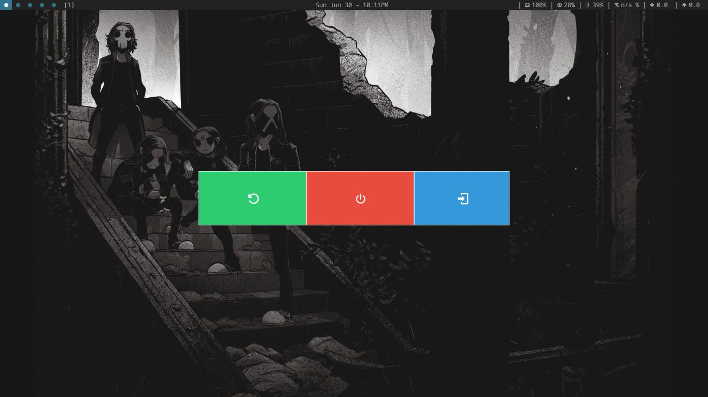

# Simple Graphical Shutdown Dialog

This is a simple graphical shutdown dialog for Linux. It is written in Python and uses Tkinter for the GUI.



## Installation

### Arch Linux

```bash
yay -S sgsd
```
